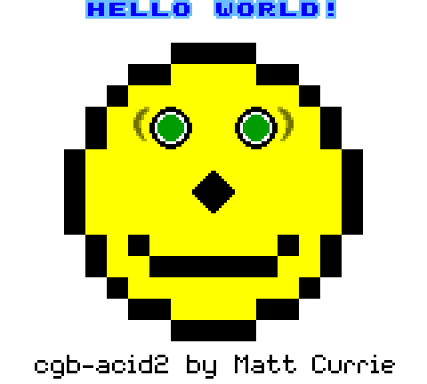

# termboy

A Game Boy, Game Boy Color, and Game Boy Advance emulator that runs in your terminal.

Written in Rust. Three emulation cores share one frontend — a half-block terminal
renderer with auto-scaling, a ROM picker grouped by hardware, configurable input,
audio, and battery saves.

## Status

**Game Boy / Game Boy Color — complete.** Full audio (all four APU channels) plays
through your system output. Game Boy Color games run in full color (banked
VRAM/WRAM, color palettes, double-speed CPU, HDMA, MBC5) alongside the original DMG
library. MBC1/MBC3/MBC5 with battery saves (`<rom>.sav`, auto-flushed) and the MBC3
real-time clock. Blargg cpu_instrs + instr_timing, dmg-acid2 and cgb-acid2 (both
pixel-exact vs official references) all pass.

**Game Boy Advance — commercial games play with sound.** ARM7TDMI CPU (jsmolka's
arm/thumb test ROMs pass headlessly), the full scanline PPU (tiled and bitmap
modes, affine backgrounds, regular and affine sprites, windows, alpha/brightness
blending, mosaic), all four DMA channels, cascading timers, the IE/IF/IME
interrupt system, an HLE BIOS (IntrWait, CpuSet, LZ77/Huffman decompression,
affine helpers, …), and audio — the four PSG channels plus both Direct Sound
DMA-FIFO channels. Pokémon boots through its intro to the title screen, plays its
music, and reaches the in-game menus. Battery saves persist for every cartridge
save type — SRAM, Flash (64K/128K), and EEPROM (4K/64K) — auto-detected from the
ROM and written to `<rom>.sav`. In release builds the core emulates well above
real time (~6× on Apple Silicon) with an allocation-free per-frame loop, so games
play at full speed; measure with `cargo run --release -p termboy-gba --example
throughput -- <rom.gba>`. That completes the GBA roadmap — cycle-exact timing
(waitstate/prefetch accuracy) is a deliberate non-goal.

- `cargo run --release -p termboy` — opens a game picker for `./roms` (GB/GBC/GBA, grouped by hardware; no argument needed)
- `cargo run --release -p termboy -- <rom>` — play a `.gb`/`.gbc`/`.gba` directly (pixel-perfect when it fits, auto-scaled to fit below that; `--exact` disables scaling)
- `--keys swap` (A/B swapped) or `--keys a=k,b=j,start=space` for custom bindings
- `--palette green|gray|pocket` or four hex colors (`--palette '#e0f8d0,#88c070,#346856,#081820'`) — Game Boy only
- `cargo run --release -p termboy -- --headless <rom.gb>` — run headless, print serial output
- `cargo test --workspace` — full test suite including hardware test ROMs

## Controls

| Key | Button |
|-----|--------|
| Arrow keys | D-pad |
| X | A |
| Z | B |
| Enter | Start |
| Tab | Select |
| A | L (GBA) |
| S | R (GBA) |
| `1`–`0` | Save state to slot 1–10 |
| Shift + `1`–`0` | Load state from that slot |
| Esc | Quit |

Save states capture the full machine and persist to `<rom>.ss0`…`<rom>.ss9`, so
they survive quitting. A brief overlay confirms each save/load. (The load
shortcut sends the shifted number — `!@#…` on a US keyboard, or number+Shift in
kitty-protocol terminals; a state saved in one game won't load into another.)

Input feels best in a terminal supporting the kitty keyboard protocol
(Ghostty, kitty, WezTerm, recent iTerm2/Alacritty) — real key-release events.
Elsewhere termboy falls back to timed release driven by OS key repeat; for a
snappier hold, reduce your OS key-repeat delay.

## Display & sharpness

termboy draws with half-block characters (each cell is one pixel wide and two
tall) and auto-scales the image to fit your terminal. When the terminal has at
least as many character cells as the console's native size — 160×72 for
GB/GBC, 240×80 for GBA — the picture is pixel-perfect; below that it's
box-filter downscaled, which looks softer.

If the image looks blurry, **zoom the terminal out** (⌘− / Ctrl−, a smaller
font) so there are enough cells for pixel-perfect rendering; **zoom in** (⌘+ /
Ctrl+) to make the picture physically larger at the cost of sharpness. In other
words, font size *is* your resolution dial.

## Test ROMs & credits

The freely redistributable test ROMs under `crates/*/tests/roms/` are not
termboy's work:

- Game Boy CPU/timing — [Blargg's gb-test-roms](https://github.com/retrio/gb-test-roms) (`cargo`-fetched by `scripts/fetch-test-roms.sh`)
- PPU accuracy — [dmg-acid2 and cgb-acid2](https://github.com/mattcurrie/dmg-acid2) by Matt Currie (the banner above is termboy's cgb-acid2 output)
- GBA — [jsmolka's gba-tests](https://github.com/jsmolka/gba-tests) (`arm`, `thumb`, `memory`, `nes`, `save`, `shades`, `stripes`), run headlessly. `bios.gba` is omitted: it requires a real BIOS dump, which termboy doesn't use (HLE BIOS). The [mGBA suite](https://github.com/mgba-emu/suite) (MIT) is a local-only diagnostic (`scripts/fetch-mgba-suite.sh`), not CI-gated.

Commercial ROMs and save files are git-ignored and never committed; bring your
own and drop them in `./roms`.
