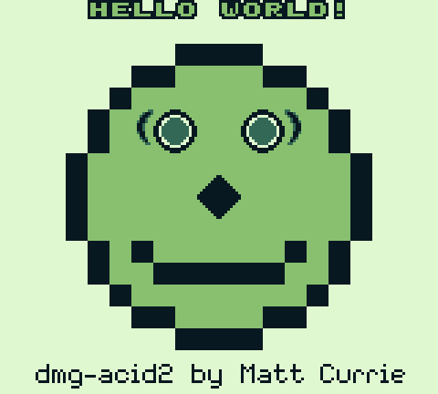

# termboy

A Game Boy and Game Boy Color emulator that runs in your terminal.

Written in Rust. Targets the original Game Boy (DMG) first, with an architecture ready for Game Boy Color support.

## Status

Full audio (all four APU channels) plays through your system output. Game
Boy Color games run in full color (banked VRAM/WRAM, color palettes,
double-speed CPU, HDMA, MBC5) alongside the original DMG library. MBC1/MBC3/MBC5 with battery saves (`<rom>.sav`, auto-flushed) and the
MBC3 real-time clock. Blargg cpu_instrs + instr_timing, dmg-acid2 AND
cgb-acid2 (both pixel-exact vs official references) all pass.

- `cargo run --release -p termboy` — opens a game picker for `./roms` (no argument needed)
- `cargo run --release -p termboy -- <rom.gb>` — play a ROM directly (pixel-perfect at 160x72+, auto-scaled to fit below that; `--exact` disables scaling)
- `--keys swap` (A/B swapped) or `--keys a=k,b=j,start=space` for custom bindings
- `--palette green|gray|pocket` or four hex colors (`--palette '#e0f8d0,#88c070,#346856,#081820'`)
- `cargo run --release -p termboy -- --headless <rom.gb>` — run headless, print serial output
- `cargo test --workspace` — full test suite including hardware test ROMs

## Controls

| Key | Button |
|-----|--------|
| Arrow keys | D-pad |
| X | A |
| Z | B |
| Enter | Start |
| Tab | Select |
| Esc | Quit |

Input feels best in a terminal supporting the kitty keyboard protocol
(Ghostty, kitty, WezTerm, recent iTerm2/Alacritty) — real key-release events.
Elsewhere termboy falls back to timed release driven by OS key repeat; for a
snappier hold, reduce your OS key-repeat delay.
